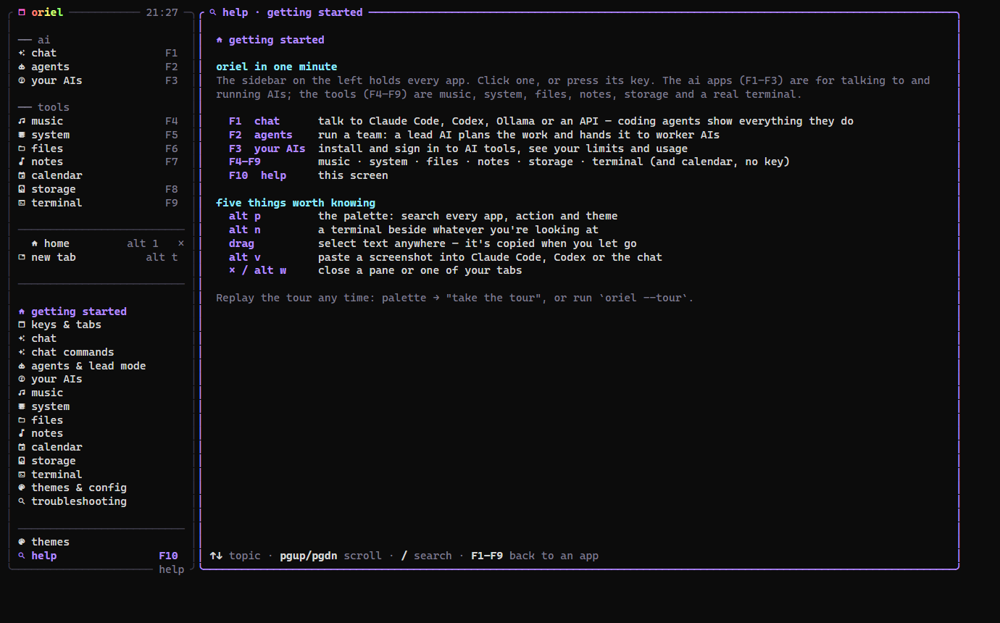
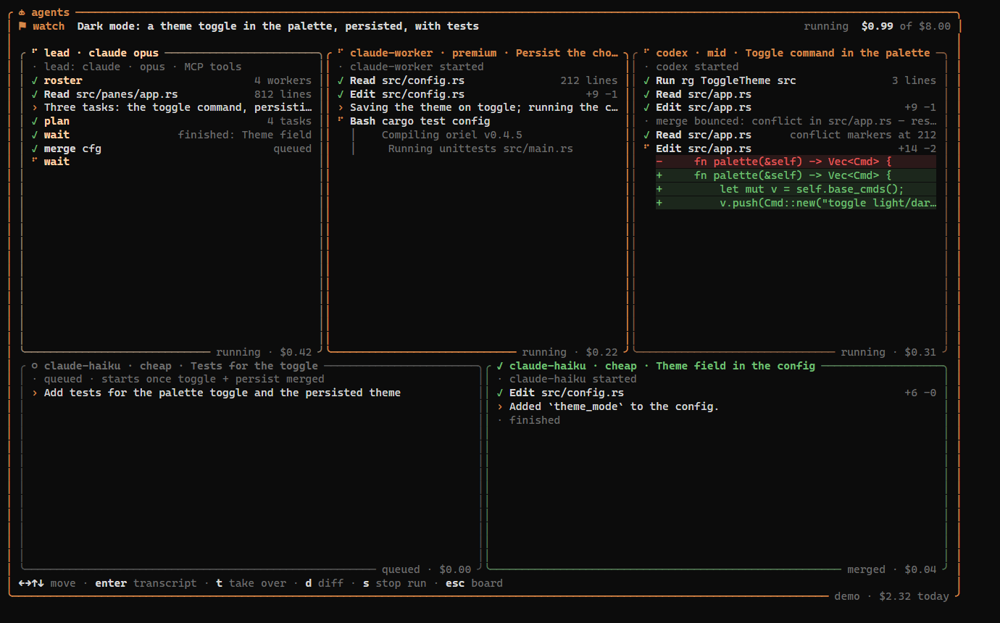

<div align="center">

# oriel

**A fast terminal workspace for AI: chat with any AI, run a team of coding agents, watch your usage and limits, plus music, a system monitor, files, notes and a real terminal, all in one window.**

Tabs and tmux-style split panes · mouse-friendly · a single ~9 MB binary for Linux and Windows

[](https://github.com/gorpnostic/z4-oriel/releases/latest)
[](LICENSE)


</div>

## Install

**Linux** (Arch/Omarchy, Ubuntu, Fedora, …)
```bash
curl -fsSL https://raw.githubusercontent.com/gorpnostic/z4-oriel/master/install.sh | sh
```

**Windows** (PowerShell)
```powershell
irm https://raw.githubusercontent.com/gorpnostic/z4-oriel/master/install.ps1 | iex
```

Then run `oriel`. To update later, run `oriel update`.

Icons need a [Nerd Font](https://www.nerdfonts.com/) in your terminal. Omarchy ships one. On Windows, pick "Cascadia
Mono NF" in Windows Terminal (Settings › Profiles › Appearance). If you see boxes instead of icons, the setup lets you
switch to plain ones.

## Getting started

1. **Run `oriel` in the folder you want to work in.** The AI chat and the agents work in the folder oriel was
   started from, so `cd` into your project first. The first run walks you through a short setup: theme, icons,
   music and notes folders, and your default AI. Then there's an optional tour of about a minute.
2. **Get an AI.** Press `F3` (your AIs), then `2` for the install list. Pick Claude Code or Codex, press `enter` to
   install and `l` to sign in. Already have one? oriel finds it on its own. Want something free and local?
   Install [Ollama](https://ollama.com).
3. **Chat.** Press `F1` and type. Claude Code and Codex can read and edit your files; you see every step live.
   Type `/` for the command menu:
   - `/provider` picks the AI;
   - `/model` picks its model;
   - `/perms` sets how much the AI may do without asking.
4. **Run a team.** Press `F2` (agents), then `L`. Type one goal, pick a lead AI and press `ctrl+s`. The lead splits
   the work between worker AIs. Press `w` to watch them, then `d` to review the result and `m` to merge it.
   [More on lead mode ↓](#lead-mode-a-team-of-agents)
5. **Stuck? Press `F10`.** The help screen lists every key and command by topic. It opens on the app you were in.

<p align="center">
  
  
</p>

## What's inside

Every app lives in the sidebar. Click one, or press its F-key.

| | App | What it does |
|---|---|---|
| | **ai** | |
| F1 | **chat** | Chat with Claude Code, Codex, Ollama, any OpenAI-compatible server, or the Anthropic API. With coding agents you see everything as it happens: every file read, edit (as a diff) and command with its output, and their todo list ticking off. Chats are saved in the sidebar. |
| F2 | **agents** | Run a team of coding agents on one goal (**lead mode**), or single tasks on a board. Each agent works in its own copy of the repo, and finished work is merged safely one piece at a time. |
| F3 | **your AIs** | Installs and signs in to 12 coding CLIs with one key: Claude Code, Codex, Kimi, OpenCode, Aider, Copilot, Cursor, Qwen, Amp, Droid, Crush and Goose. It also shows your real plan limits with reset countdowns, tokens and cost per day, and has token-saver presets. |
| | **tools** | |
| F4 | **music** | Plays your music folder: cover art, a live spectrum, synced lyrics, playlists, shuffle and repeat. `F12` plays/pauses from any app. |
| F5 | **system** | A task manager: a summary, processes as a list or tree (sort, filter, kill), per-core graphs, startup apps, services, network connections and system info. |
| F6 | **files** | A folder tree with previews: highlighted code, images drawn in the terminal, READMEs. |
| F7 | **notes** | Markdown notes that save as you type, with a live preview. |
| F8 | **storage** | Frees up space. It finds what's safe to clean (caches, temp files, trash), shows the biggest folders, and uninstalls apps. It also has a catalog of 60+ popular apps (OBS, Steam, Minecraft launchers, VPNs, AI apps, dev tools, browsers…) that install with one key, using whichever package manager your system has: winget, pacman/AUR, apt, flatpak or npm. Nothing is deleted or installed without asking. |
| F9 | **terminal** | A real shell. Split it next to anything. |
| F10 | **help** | Every key, command and how-to, by topic. |


<p align="center">
  
  
</p>

## How do I…

| I want to… | Do this |
|---|---|
| open two things side by side | `alt n` opens a terminal beside the current pane. For any app: `alt p` → "split: open music beside this" |
| make my own tab | `alt t`, or click **new tab** in the sidebar. It starts on a launcher; press a letter to open an app in it |
| rename or close a tab | double-click it in the sidebar to rename. Click its **×** or middle-click it to close it |
| close a pane (split) | click the **×** in the top-right corner of its frame, or `alt w` |
| copy text | drag over it with the mouse. It's copied when you let go (`shift`+drag in programs that use the mouse) |
| paste a screenshot into Claude Code | copy the image, then press `alt v`. oriel saves it as a file and pastes the path, which Claude Code and Codex attach. Windows Terminal keeps `ctrl v` for text only, which is why it's `alt v` |
| switch AI or model | `/provider codex`, `/model opus`. Both menus list your choices as you type, and both are remembered |
| stop the AI asking for permission | `/perms bypass` (lets it do anything; only in folders you trust) or `/perms edits` (edits files, refuses the rest) |
| make the AI ask before every change | `/perms ask`. Then `y` allows, `n` denies, `a` always allows that tool |
| use the real Claude Code or Codex screen | run `claude` or `codex` in a terminal pane. Its tab gets status dots (below) |
| work in another folder | start oriel there, or `/cwd <folder>` for one chat, or `o` in agents to pick a repo |
| install another AI tool | `F3` → `2` → `enter` on it |
| save tokens | `F3` → `4` (token saver) → pick a preset → `enter` |
| change the theme | `alt p` → type `theme`, or `/theme` in chat |
| find anything else | `alt p` searches every app, action and theme, and `F10` explains them |

## Keys

| Key | Does |
|---|---|
| `F1`–`F10` | switch apps (`F12` plays/pauses music from anywhere) |
| `alt p` | the palette: every app, action and theme, searchable |
| `alt n` | a terminal beside the current pane |
| `alt t` · `alt 1-9` | new tab · go to one of your tabs |
| `alt ←↑↓→` | move between panes (`alt shift ←↑↓→` resizes, or drag a divider) |
| `alt z` · `alt w` · `alt s` | zoom a pane · close it · hide the sidebar |
| double-click a tab | rename it (or right-click → rename) |
| right-click | menu: split, zoom, rename, new tab, close |
| drag | select text in any pane and copy it |
| `alt v` | paste a clipboard image (or copied files) as a path |
| `?` | help, in any app that doesn't use the key itself |
| `ctrl+space`, then `\|` `-` `hjkl` `x` `z` `c` `,` | tmux-style: split right, split down, move, close, zoom, new tab, rename |

Each app shows its own keys along its bottom edge, and `F10` lists them all. The mouse works everywhere: click to
focus, drag a divider to resize, scroll lists.

### Agents in terminals

Run Claude Code, Codex or another coding agent in a terminal tab and oriel keeps an eye on it. The tab gets a
status dot:

- ◐ working
- a red ● when it needs your answer
- a green ● when it finished while you were in another tab

You also get a notification, so you can run several agents side by side and only switch when one needs you.

## Lead mode: a team of agents



You give one goal, and a **lead** AI of your choice plans it. The lead can be Claude Code, Codex, Kimi or any other
supported agent. It splits the goal into small tasks and hands them to **workers**.

1. Start oriel inside a git repo, or press `o` in agents to pick one.
2. `F2` → `L`. Type the goal, then pick the lead, its model, how many workers run at once and a budget. `ctrl+s`
   starts the run.
3. `w` watches the lead and every worker live, side by side. `enter` on a card opens that agent's full
   transcript, and `t` takes a worker over in a real terminal.
4. When it's done, `d` shows the combined diff and `m` merges it into your branch. oriel never pushes.

How it keeps workers from breaking each other:

- Every worker codes in its own git worktree, so two workers never touch the same files at once.
- Finished work goes through a merge queue into a separate branch (`oriel/lead-…`), one task at a time. Each merge
  is checked for conflicts and has to pass your build or tests first.
- A watchdog notices a worker that's stuck or looping, nudges it, and restarts or reassigns the task if needed.
- The lead sees your plan limits and sends simple work to cheaper models. The run stops starting new work when its
  budget is spent.

**The roster** is the list of workers the lead can use. Press `R` in agents to edit it. By default it's built from
the AIs you have installed. Each worker has an AI, a model, a cost tier (cheap, mid or premium), what it's good at,
and a budget per task. The design notes are in [docs/research-orchestration.md](docs/research-orchestration.md).

<p align="center">
  
  
</p>

## AI setup

oriel uses whatever you already have and picks the first one it finds. `F3` installs most of these for you.

- **Claude Code**: `npm i -g @anthropic-ai/claude-code`, then run `claude` once to sign in.
- **Codex**: `npm i -g @openai/codex`, then `codex login`.
- **Ollama**: install from [ollama.com](https://ollama.com) and `ollama pull llama3.2`. It's free and runs on your
  own machine.
- **API keys**: `/key openai <key>` or `/key anthropic <key>` in the chat. The OpenAI option works with any
  compatible server: OpenRouter, LM Studio, llama.cpp…

**Permissions for coding agents:** `/perms` sets what Claude Code and Codex may do in chat. It's remembered for
every chat.

- `ask`: approve each edit or command.
- `edits` (the default): edit files in the chat's folder.
- `plan`: read-only.
- `bypass`: Claude Code's *bypass permissions* mode, which allows everything. Use it only in folders you trust.

## Themes

`alt p` → type `theme`. Themes preview live as you move through the list. The default is **ultra**, with a soft
animated rainbow. The others are oriel, ember, ocean, forest, sakura, synthwave, matrix, amber, dracula and mono.
There are also:

- **terminal**, which uses your terminal's own colours;
- **omarchy** (the default on [Omarchy](https://omarchy.org)), which follows your Omarchy theme and recolours
  instantly when you switch.

## Configuration

`oriel --config` prints where the config file is: `~/.config/oriel/config.toml`, or `%APPDATA%\oriel\config.toml`
on Windows. The setup and the in-app commands write it for you, and every setting is optional:

```toml
theme = "ultra"
shell = "zsh"                 # terminal panes; default: $SHELL / PowerShell
prefix = "ctrl+space"         # tmux-style prefix key
startup = "ai"                # app to open on start (also: oriel music, oriel agents…)
notes_folder = "~/notes"

[ai]
provider = "claude"           # default AI; empty = the first one found
perms = "edits"               # ask | edits | plan | bypass
models = { claude = "opus", codex = "gpt-5.6-terra" }
openai_url = "https://openrouter.ai/api/v1"

[music]
folders = ["~/Music"]

[lead]
agent = "codex"               # who leads; empty = the last one you picked
run_budget_usd = 8.0          # cap for a whole run, lead + workers
max_parallel = 3              # workers at once
gate = "cargo test"           # must pass before each merge; empty = detect, "none" = off

[[roster]]
name = "kimi"
agent = "kimi"
tier = "cheap"
good_at = "frontend, UI"
budget_usd = 1.0
```

Other commands: `oriel update`, `oriel --tour` (replay the setup and tour), `oriel --version`.

## Build from source

Needs [Rust](https://rustup.rs). On Linux you also need the ALSA headers: `alsa-lib` on Arch, `libasound2-dev` on
Debian/Ubuntu.

```bash
git clone https://github.com/gorpnostic/z4-oriel && cd z4-oriel
cargo run --release
```

See [docs/DEVELOPING.md](docs/DEVELOPING.md) for tests and releases.

## Troubleshooting

- **Icons show as boxes:** your terminal font has no icons. Install a Nerd Font, or `alt p` → "toggle nerd font icons".
- **`alt enter` goes fullscreen:** Windows Terminal takes that key. Use `alt n` for a new terminal.
- **`ctrl v` won't paste an image:** Windows Terminal only pastes text with it. Use `alt v`.
- **The AI says actions were blocked:** loosen `/perms` (see above).
- **An update didn't stick:** close every oriel window and run the install line again.

## Uninstall

Delete the binary: `~/.local/bin/oriel` on Linux, `%LOCALAPPDATA%\oriel` on Windows. Settings and chats live in
`~/.config/oriel` and `~/.local/share/oriel`, or `%APPDATA%\oriel` on Windows.

## License

[MIT](LICENSE)
