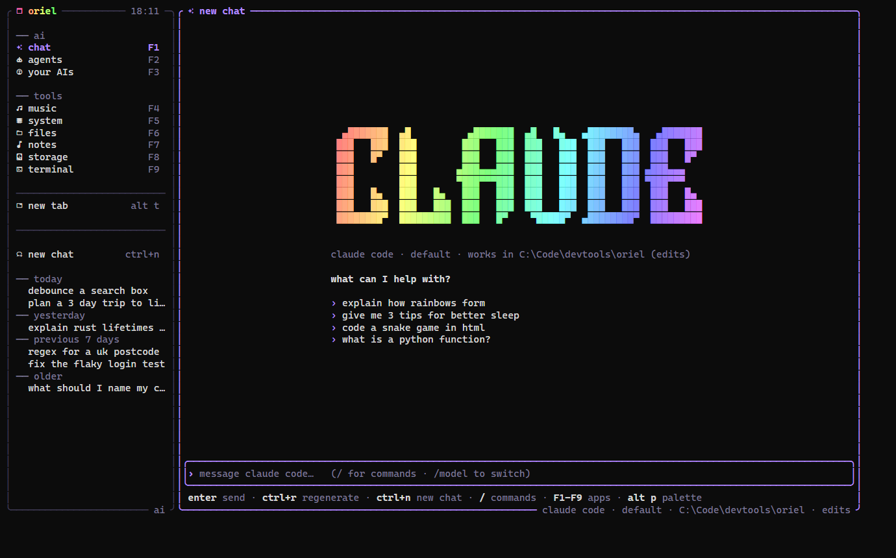
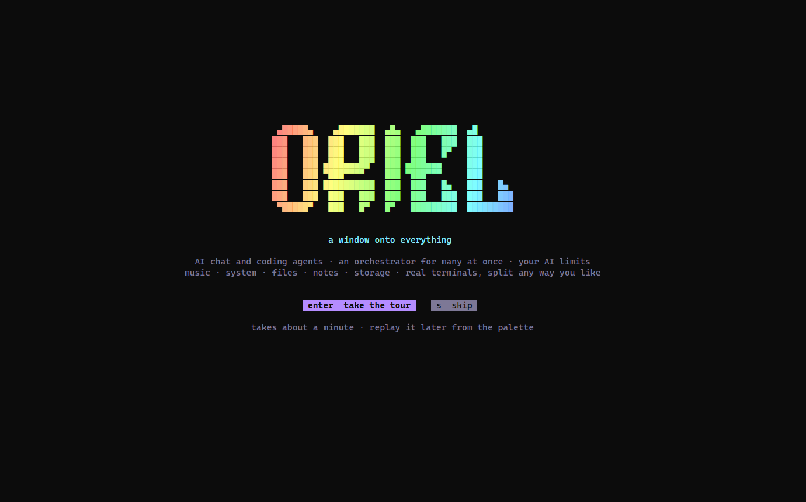
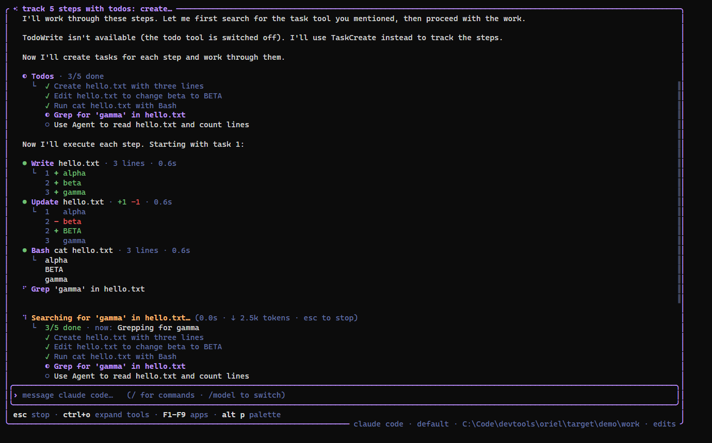
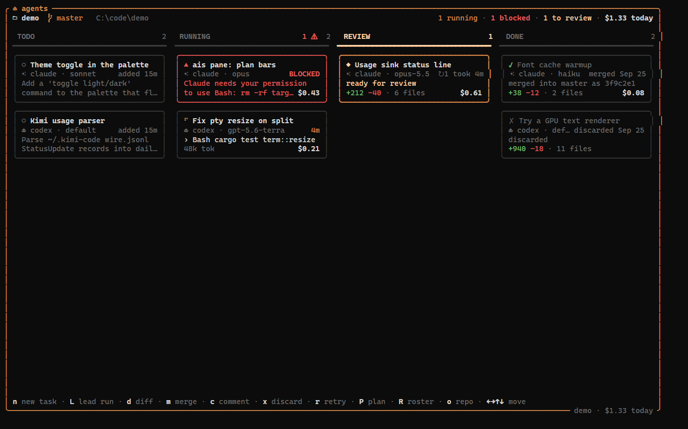
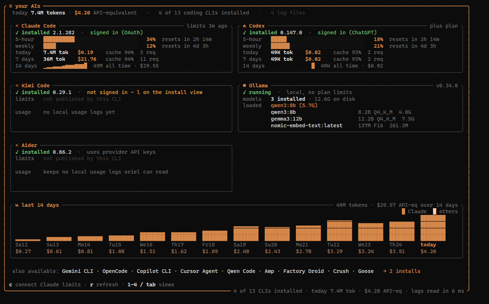
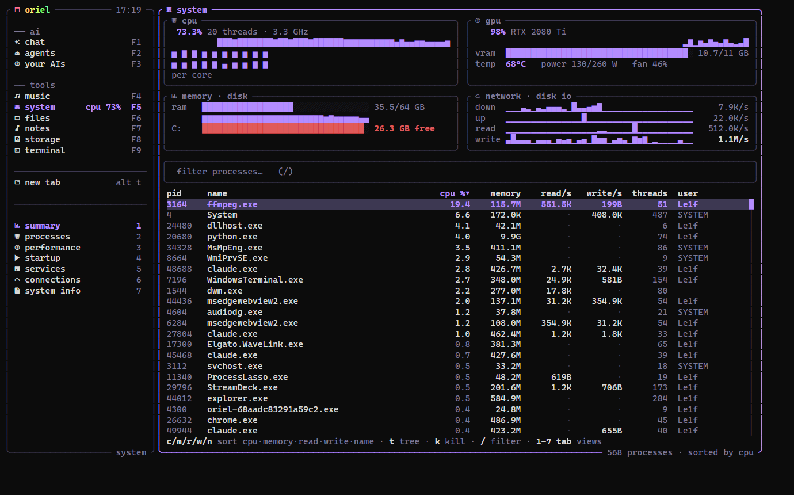
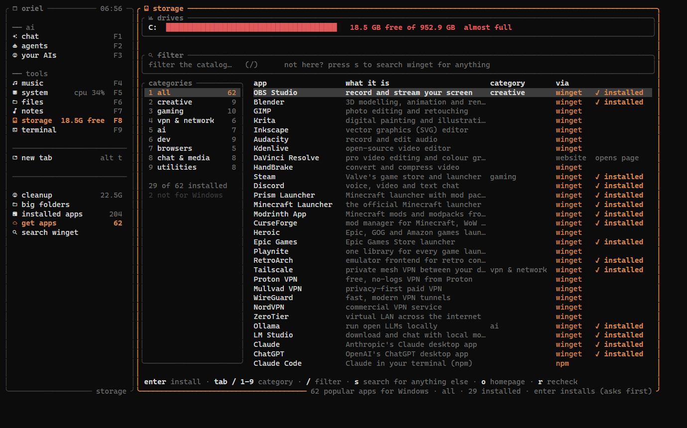

<div align="center">

# oriel

**A fast terminal workspace: AI chat, a multi-agent orchestrator, AI usage and limits, music, a system monitor, files, notes and a real terminal, all in one window.**

Tabs and tmux-style split panes · mouse-friendly · a single ~9 MB binary for Linux and Windows

[](https://github.com/gorpnostic/z4-oriel/releases/latest)
[](LICENSE)



</div>

## Install

**Linux** (Arch/Omarchy, Ubuntu, Fedora, …)
```bash
curl -fsSL https://raw.githubusercontent.com/gorpnostic/z4-oriel/master/install.sh | sh
```

**Windows** (PowerShell)
```powershell
irm https://raw.githubusercontent.com/gorpnostic/z4-oriel/master/install.ps1 | iex
```

Then run `oriel`. The first run walks you through a short setup (theme, icons, music and notes folders, your
default AI) and an optional one-minute tour. Replay it any time with `oriel --tour` or from the palette. To update
later, run `oriel update`.

<p align="center"></p>

Icons need a [Nerd Font](https://www.nerdfonts.com/) in your terminal. Omarchy ships one. On Windows, pick "Cascadia
Mono NF" in Windows Terminal (Settings › Profiles › Appearance).

## What's inside

Every app lives in the sidebar. Click one, or press its F-key.

| | App | What it does |
|---|---|---|
| | **ai** | |
| F1 | **chat** | Chat with Claude Code, Codex, Ollama, any OpenAI-compatible server, or the Anthropic API. Coding agents show their full live transcript as they work: every file read, edit (as a diff), command and output, plus their todo list ticking off. `/perms ask` makes them ask before each change. History is kept, and `/` opens a command menu. |
| F2 | **agents** | An orchestrator for several coding agents at once. Each task gets its own git worktree and a Claude Code or Codex tab. A board shows todo / running / blocked / review / done, with the cost of each task. You get a notification when an agent needs you, then review its diff (with a conflict check) and squash-merge or discard it. `P` has a lead agent plan the tasks for you. |
| F3 | **your AIs** | Everything about your AI tools in one place. It shows which coding CLIs are installed and signed in, and installs or signs in to 13 of them with one key: Claude Code, Codex, Kimi, Gemini, OpenCode, Aider, Copilot, Cursor, Qwen, Amp, Droid, Crush and Goose. It also shows your real plan limits with reset countdowns, token use and cost per day, and has token-saver presets. |
| | **tools** | |
| F4 | **music** | Plays your music folder: cover art, a live spectrum, synced lyrics, playlists, shuffle and repeat. `F12` plays/pauses from any app. |
| F5 | **system** | A task manager. It has a summary, a process list or tree (sort, filter, kill; per-process disk activity), per-core performance graphs, startup apps, services, network connections by process, and system info. |
| F6 | **files** | A folder tree with previews: highlighted code, images drawn in the terminal, READMEs. |
| F7 | **notes** | Markdown notes that autosave, with a live preview. |
| F8 | **storage** | Frees up space: it finds what's safe to clean (caches, temp files, trash), shows the biggest folders, and uninstalls apps. It also has a catalog of 60+ popular apps (OBS, Steam, Minecraft launchers, VPNs, AI apps, dev tools, browsers…) that installs with one key, using winget, pacman/AUR, apt, flatpak or npm to match your system. Nothing is deleted or installed without asking. |
| F9 | **terminal** | A real shell. Split it next to anything. |



<p align="center">
  
  
</p>

<p align="center">
  
  
</p>

## Using it

| Key | Does |
|---|---|
| `F1`–`F9` | switch apps (`F12` plays/pauses music) |
| `alt p` | the palette: every app, action and theme, searchable |
| `alt n` | open a terminal beside the current pane |
| `alt t` / `alt 1-9` | new tab / go to tab |
| `alt ←↑↓→` | move between panes (`alt shift ←↑↓→` resizes) |
| `alt z` · `alt w` · `alt s` | zoom a pane · close it · hide the sidebar |
| double-click a tab | rename it (also right-click → rename, or `ctrl+space` then `,`) |
| right-click | menu: split, zoom, rename, new tab, close |
| `ctrl+space` then `\|` `-` `x` `?` | tmux-style: split right, split down, close, list all keys |

Each app shows its own keys along its bottom edge. The mouse works everywhere: click to focus, drag a divider to
resize, scroll lists.

### Agents in terminals

Run Claude Code, Codex or another coding agent in a terminal tab, and oriel keeps an eye on it. The tab gets a
status dot:

- ◐ working
- a red ● when it needs your answer
- a green ● when it finished while you were in another tab

You also get a notification, so you can run several agents side by side and only switch when one needs you.

### AI setup

oriel uses whatever you already have and picks the first one it finds:

- **Claude Code**: `npm i -g @anthropic-ai/claude-code`, then run `claude` once to sign in.
- **Codex**: `npm i -g @openai/codex`, then `codex login`.
- **Ollama**: install from [ollama.com](https://ollama.com) and `ollama pull llama3.2`. It's free and runs on your machine.
- **API keys**: `/key openai <key>` or `/key anthropic <key>` in the chat. The OpenAI option works with any
  compatible server: OpenRouter, LM Studio, llama.cpp…

Switch any time with `/model`. Type `/` to see every command.

## Themes

`alt p` → type `theme`. Themes preview live as you move through the list. The default is **ultra**, with a soft
animated rainbow. The others are oriel, ember, ocean, forest, sakura, synthwave, matrix, amber, dracula and mono.
There are also:

- **terminal**, which uses your terminal's own colours;
- **omarchy** (the default on [Omarchy](https://omarchy.org)), which follows your Omarchy theme and recolours
  instantly when you switch themes.

## Configuration

`oriel --config` prints where the config file is: `~/.config/oriel/config.toml`, or `%APPDATA%\oriel\config.toml`
on Windows. Every setting is optional:

```toml
theme = "omarchy"
shell = "zsh"                 # terminal panes; default: $SHELL / PowerShell
prefix = "ctrl+space"         # tmux-style prefix key
startup = "ai"                # app to open on start

[ai]
provider = "claude"           # default AI; empty = the first one found
ollama_model = "llama3.2"
openai_url = "https://openrouter.ai/api/v1"
openai_model = "anthropic/claude-sonnet-5"

[music]
folders = ["~/Music"]
```

## Build from source

Needs [Rust](https://rustup.rs). On Linux you also need the ALSA headers: `alsa-lib` on Arch, `libasound2-dev` on
Debian/Ubuntu.

```bash
git clone https://github.com/gorpnostic/z4-oriel && cd z4-oriel
cargo run --release
```

See [docs/DEVELOPING.md](docs/DEVELOPING.md) for tests and releases.

## Uninstall

Delete the binary: `~/.local/bin/oriel` on Linux, `%LOCALAPPDATA%\oriel` on Windows. Settings and chats live in
`~/.config/oriel` and `~/.local/share/oriel`, or `%APPDATA%\oriel` on Windows.

## License

[MIT](LICENSE)
